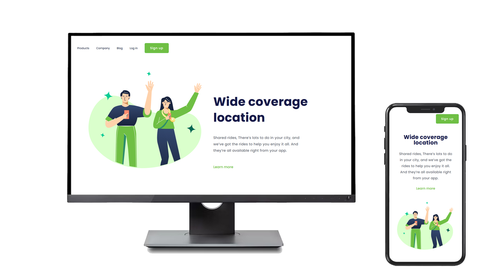

# 🚖 Urban Connection
Oi! Esse é o **Urban Connection**, um projeto de página responsiva que simula a landing page de um app de transporte urbano, tipo um Uber da vida, com visual moderno e clean.
O foco aqui foi trabalhar **HTML e CSS puro**, sem nenhum framework ou biblioteca externa. Criei uma versão totalmente responsiva — se adapta bonitinho tanto no desktop quanto no celular! 📱💻

---

## 🔧 Tecnologias usadas

- 

- 

---

## 💡 O que tem na página?

- Layout moderno e responsivo  
- Menu superior com links (sem funcionalidades, só visual)  
- Botão de **Sign up**  
- Texto de destaque com chamada para ação  
- Seção "Learn more" para simular um aprofundamento

---

## 🎯 Objetivo

O principal objetivo foi treinar HTML e CSS com foco em:

- Responsividade (mobile-first)  
- Posicionamento com Flexbox  
- Estilização moderna  
- Boas práticas de organização do código

---

## 📸 Preview

Abaixo você vê como a interface se adapta entre desktop e mobile:

---

## 📁 Como rodar

1. Baixe ou clone este repositório  
2. Abra o arquivo `index.html` no seu navegador  
3. Pronto! 🚀

---